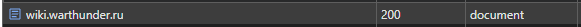
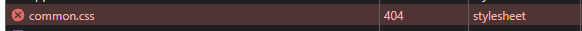
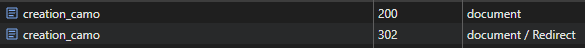

1.   
wiki.warthunder.ru | 200 | document - документ найден и загружен со статусом OK

3.   
common.css | 404 | stylesheet - таблица стилей не найдена на сервере

4.   
generate_204?AsPT6w | 204 | text/plain - ресурс(текст) получен успешно, но без содержимого (No Content)

5.   
KFO7CnqEu92Fr1ME7kSn66aGLdTylUAMa3iUBGEe.woff2 | 200 | font - скаичвание шрифта с сервера прошло со статусом OK

6.   
creation_camo | 302 | document / Redirect - сервер принял запрос к странице(Found), но она находится по другом адресу, поэтому перенаправил на другую страницу(Redirect).
